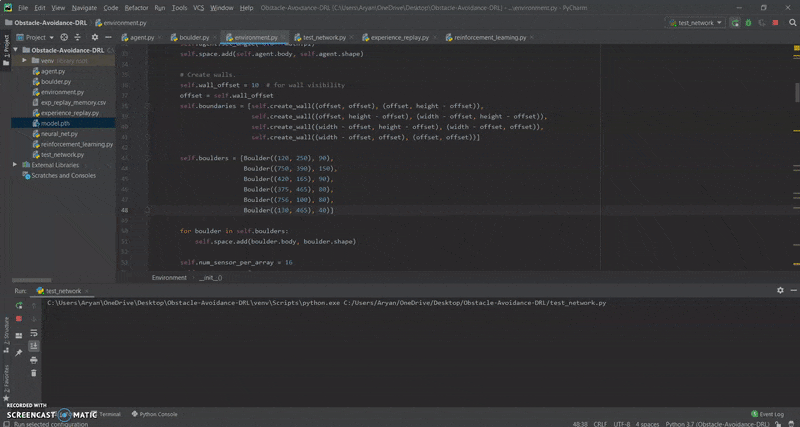

# Obstacle-Avoidance
Things I wish I was aware of before I started this project:
* Overfitting: I did not realize that my model overfit until a few months had gone by and I happened to stumble upon a blog post about DRL.
* Keeping track of a loss plot: Honestly, this was a really dumb mistake on my part since I forgot to dump my loss_over_time into a csv file.
* Kaggle is much better than Google Colab. I wasted so many days on Colab, only to end up training my model on my laptop's CPU.

# Model Demo
Here is what the final result looks like. It's not perfect and the agent often crashes into the boulder on the far left edge of the screen (as you'll see below). However, this behavior has been consistent ever since the agent crossed roughly 3 million frames during the training phase and it never really went away.

